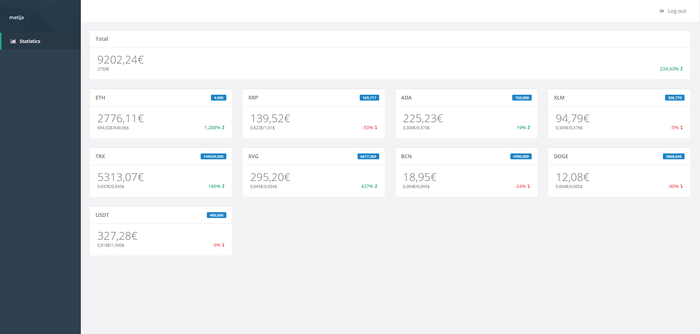

# Crypto Dashboard

This project is about crypto currencies, which tokens do you own and how much profit did you gain.

Into DB you insert tokens that you have in your wallets, you insert the token name, the number of tokens and invested money (needed for calculation). If you have some tokens on some exchanges I added APIs for two exchanges Binance and Poloniex.
In calculation part it sums up tokens in your wallet (DB) and from both exchanges and calculates it with the latest values obtained from Cryptocompare API.

## Screenshot
[](public/img/crypto-thumbnail.jpg)

## Exchanges Implemented:
-	Binance
-	Poloniex
-   Bittrex

## Requirements:
-	PHP 7.1+
-	sqlite
-   composer
-   npm
## Specifications:
-	Symfony 4 framework

## Run
```
composer install
php bin\console doctrine:migrations:migrate
php bin\console fos:user:create
npm install
node_modules\.bin\encore dev
```
